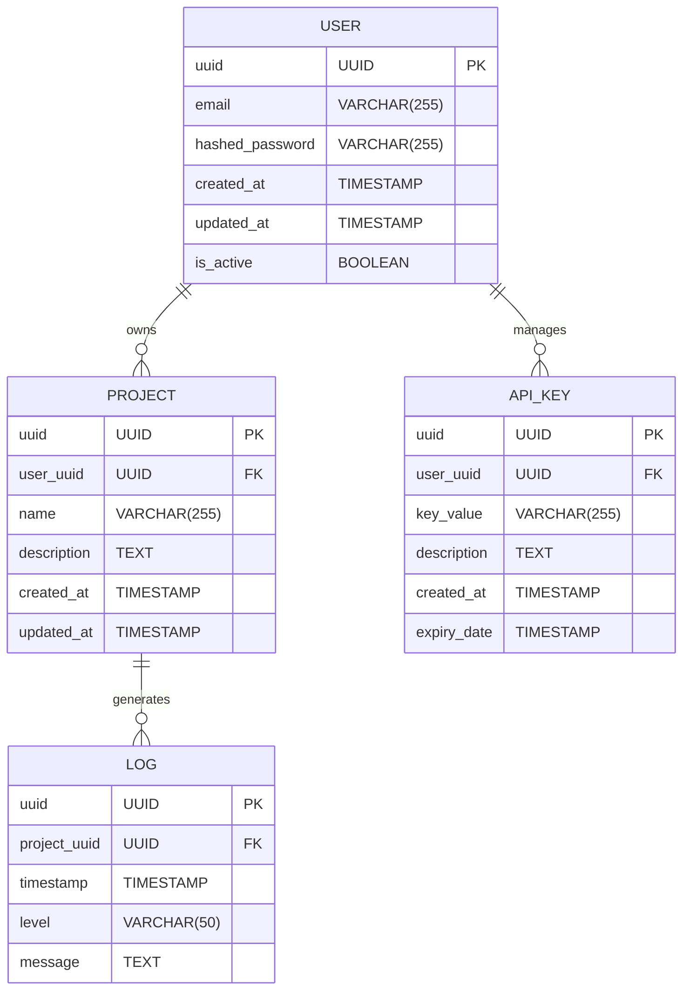

# SaaS 개발자 도구 자동화 플랫폼 V6 Master Plan

## 1. 전략 및 DNA 분석 (Strategy & DNA)

- **Pain Point Analysis**:
    * **시간/비용 문제**: 개발자들이 반복적인 설정 및 배포 작업에 많은 시간을 소비하고, 이로 인해 핵심 기능 개발에 집중하기 어려워 불필요한 비용 발생.
    * **복잡성 문제**: 다양한 개발 도구 및 환경 설정의 복잡성으로 인해 개발 초기 진입 장벽이 높고, 에러 발생 시 디버깅 어려움.
    * **유지보수 문제**: 지속적인 유지 보수 및 업데이트 관리가 필요하지만, 인력 부족 또는 전문성 부족으로 어려움 발생.
    * **보안 문제**: 개발/배포 과정에서 보안 취약점 발생 및 관리에 대한 부담 증가.

- **Killer Features**:
    1. **원클릭 자동화:** 클릭 한 번으로 필요한 개발 도구 스택 설정 및 배포 자동화 (예: Next.js, Supabase, PostgreSQL, Redis 등). Docker 컨테이너 기반 자동 배포 지원.
    2. **코드 기반 설정 (IaC):** 코드를 통해 인프라 설정 및 관리 가능. Terraform, Pulumi 등 IaC 도구 통합 지원. 버전 관리 시스템 (Git) 연동을 통한 설정 변경 추적 및 롤백 지원.
    3. **실시간 모니터링 및 알림:** 시스템 성능 및 에러 발생 시 실시간 모니터링 및 알림 제공. Sentry, Prometheus, Grafana 등 모니터링 도구 통합 및 커스터마이징 대시보드 제공.

- **Auto-Growth Strategy**:
    * **SEO Keywords**: "개발 자동화", "SaaS 개발", "DevOps 자동화", "인프라 자동화", "IaC", "NoOps", "클라우드 배포 자동화", "로우코드 개발", "노코드 개발", "개발 생산성 향상". 관련 키워드 블로그 콘텐츠, 튜토리얼, 성공 사례 제작 및 배포.
    * **Viral Hooks**:
        * **무료 티어 제공**: 제한적인 기능의 무료 티어를 제공하여 초기 사용자 확보 및 입소문 유도.
        * **추천인 제도**: 추천을 통해 사용자 및 추천인 모두에게 보상 (예: 크레딧, 기능 제한 해제) 제공.
        * **커뮤니티 빌딩**: 개발자 커뮤니티 (Slack, Discord) 운영 및 적극적인 참여 유도.
        * **오픈소스 기여**: 핵심 라이브러리 오픈소스화 및 참여 유도.
        * **숏폼 콘텐츠**: TikTok, YouTube Shorts 등 플랫폼을 활용하여 개발 자동화 관련 팁과 데모 영상 제작 및 배포.

## 2. 멀티 에이전트 협업 설계 (Multi-Agent Workflow)

- **Roles**:
    * **PM (Product Manager)**: 프로젝트 전반적인 관리, 로드맵 설정, 우선순위 결정, 시장 조사, 사용자 피드백 수집 및 분석.
    * **Designer (UI/UX Designer)**: 사용자 인터페이스 디자인, 사용자 경험 개선, 디자인 시스템 유지보수.
    * **Developer (Frontend, Backend, DevOps)**: 기능 개발, 백엔드 API 개발, 인프라 구축 및 자동화, 코드 리뷰, 테스트. FE는 Next.js, BE는 FastAPI (Python) 활용.
    * **Tester (QA Engineer)**: 테스팅 시나리오 작성, 기능 테스트, 성능 테스트, 보안 테스트, 버그 리포트 작성. PM과 협력하여 user acceptance 테스트 주도.

- **Workflow**:
    1. **PM이 JIRA에 사용자 스토리 생성**: 기능 요구사항, 우선순위, 예상 완료 시간 등을 명시.
    2. **Designer가 사용자 스토리 기반으로 UI/UX 디자인 생성**: Figma를 활용하여 디자인 프로토타입 제작 및 공유. 디자인 검토 회의를 통해 피드백 반영.
    3. **Developer가 디자인 구현**: frontend, backend, DevOps 엔지니어별로 역할 분담. Git 브랜치 전략 (예: feature branch, develop branch, main branch) 활용하여 코드 관리.
    4. **Tester가 개발 완료된 기능 테스트**: JIRA에 버그 리포트 작성 및 개발자에게 할당.
    5. **Developer가 버그 수정**: 수정된 코드를 Git에 커밋 및 푸시.
    6. **CI/CD 파이프라인을 통해 자동 배포**: GitHub Actions 또는 GitLab CI/CD 활용.
    7. **PM이 배포된 기능 검토 및 승인**: 사용자 피드백을 수집하여 다음 사용자 스토리 반영.
    8. **Slack 또는 Discord 채널을 통해 팀원 간 실시간 소통**: 진행 상황 공유, 문제 해결, 의사 결정.

## 3. 스티치 디자인 시스템 (Stitch Design)

- **Components**:
    * **Dashboard**: shadcn/ui + Tailwind CSS 기반 대시보드 레이아웃. 데이터 시각화를 위한 Chart.js 또는 Recharts 통합.
    * **Login/Register**: 사용자 인증 및 권한 관리를 위한 로그인/등록 페이지. NextAuth.js 활용.
    * **Form**: 입력 유효성 검사 및 에러 핸들링을 위한 폼 컴포넌트. Zod 또는 React Hook Form 활용.
    * **Table**: 데이터 테이블 컴포넌트. 정렬, 검색, 페이지네이션 기능 지원.
    * **Button**: 다양한 스타일의 버튼 컴포넌트. primary, secondary, danger 버튼 제공.
    * **Alert**: 성공, 경고, 오류 메시지 표시를 위한 알림 컴포넌트.
    * **Modal**: 팝업 창 컴포넌트.
    * **Dropdown**: 드롭다운 메뉴 컴포넌트.
    * **Card**: 정보 카드 컴포넌트.

- **Visual Theme**:
    * **Colors**:
        * **Primary**: `#2563EB` (Blue)
        * **Secondary**: `#475569` (Gray)
        * **Accent**: `#F59E0B` (Orange)
        * **Background**: `#0F172A` (Dark Gray)
        * **Text**: `#E2E8F0` (Light Gray)
    * **Fonts**:
        * **Primary**: "Inter", sans-serif
        * **Secondary**: "Roboto", sans-serif
    * **Look and Feel**: Deep & Professional. 다크 모드 기본 적용, 깔끔하고 현대적인 디자인. 그림자와 블러 효과를 사용하여 깊이감 강조.

## 4. 초정밀 기술 설계 (TRD)

- **Architecture**:
    * **Frontend**: Next.js App Router (TypeScript)
    * **Backend**: FastAPI (Python) - API 서버 구축 및 비동기 작업 처리. Celery + Redis 활용하여 background 작업 관리.
    * **Database**: Supabase (PostgreSQL) - 사용자 데이터, 프로젝트 데이터, 로그 데이터 저장.
    * **Infrastructure**: Docker, Docker Compose, Kubernetes (optional). AWS, GCP, Azure 등 클라우드 플랫폼에 배포.
    * **Authentication**: NextAuth.js (Frontend), JWT (FastAPI)
    * **CI/CD**: GitHub Actions 또는 GitLab CI/CD

- **Database**:

- **Security**:
    * **RLS (Row Level Security) Policies**: Supabase RLS를 통해 데이터 접근 권한 관리. 사용자 데이터는 해당 사용자만 접근 가능하도록 설정. 프로젝트 데이터는 프로젝트 소유자만 접근 가능하도록 설정.
    * **API Key Management**: API 키를 통해 외부 API 접근 제어. API 키 로테이션 정책 및 만료일 설정. API 키 유출 방지를 위해 암호화 저장 및 접근 제한.
    * **Input Validation**: 모든 API 엔드포인트에서 입력 값 유효성 검사. Zod 또는 Pydantic 활용.
    * **Rate Limiting**: API 남용 방지를 위해 요청 횟수 제한.
    * **CORS (Cross-Origin Resource Sharing)**: CORS 설정을 통해 허용된 도메인에서만 API 접근 허용.
    * **SQL Injection 방지**: PreparedStatement 또는 ORM을 사용하여 SQL injection 공격 방지.

## 5. 유령 테스터 & 자가 진화 (Ghost Testing)

- **Ghost Scenarios**:
    1. **New User Onboarding**:
        * 회원 가입 후 로그인 성공.
        * 프로젝트 생성 및 개발 환경 설정 자동화 성공.
        * 생성된 프로젝트에 API 키 생성 및 사용.
        * 에러 발생 시 로그 확인 및 문제 해결.
    2. **Existing User with Multiple Projects**:
        * 여러 프로젝트를 관리하며, 각 프로젝트별 API 키 관리.
        * 프로젝트 복제 기능 테스트 및 새로운 프로젝트 생성.
        * 프로젝트 삭제 및 데이터베이스 정리 확인.
        * 각 프로젝트별 로그 확인 및 이상 징후 감지.
    3. **Stress Test**:
        * 동시 접속 사용자 수를 늘려 시스템 성능 측정.
        * API 엔드포인트에 과도한 요청을 보내 rate limiting 기능 테스트.
        * 데이터베이스 성능 모니터링 및 병목 현상 분석.
        * 시스템 장애 발생 시 자동 복구 기능 테스트.

- **Self-Healing**:
    * **Automated Error Monitoring**: Sentry, Prometheus 등 도구를 활용하여 실시간 에러 모니터링.
    * **Automatic Rollback**: 배포 실패 시 이전 버전으로 자동 롤백.
    * **Health Checks**: 시스템 상태를 주기적으로 확인하고, 문제가 발생하면 자동으로 재시작 또는 스케일 아웃. Kubernetes health checks 활용.
    * **Log Analysis**: ELK 스택 또는 Splunk를 사용하여 로그 분석 및 이상 징후 감지. 머신러닝 기반 이상 감지 시스템 구축.
    * **Alerting**: 문제가 발생하면 Slack 또는 이메일을 통해 자동 알림.

This Master Plan provides a solid foundation for building your SaaS developer tool automation platform. Good luck!
